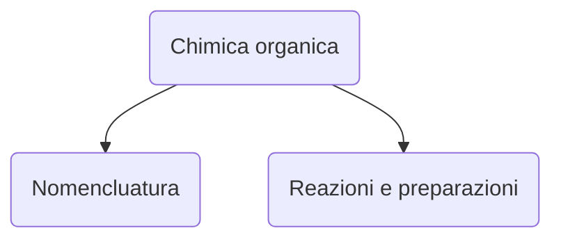

# Lezione di chimica (2° ora)
## Martedì 7 dicembre 2021, 08:59:00




|Nomenclatura|Reazioni e preparazioni|
|---|---|
|Alcani <hr />$$sp^3$$|saturi $\implies$ sostituzione|
|Alcheni

*[Alcani] :
``` 
 | |
-C-C-
 | |
 ``` 
<!--stackedit_data:
eyJoaXN0b3J5IjpbLTEyOTkyMTMxMTldfQ==
-->