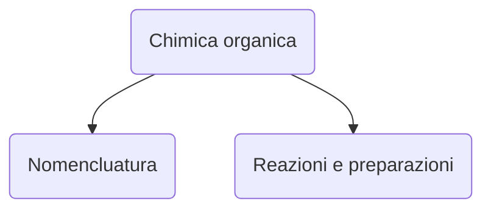

# Lezione di chimica (2° ora)
## Martedì 7 dicembre 2021, 08:59:00




|Nomenclatura|Reazioni e preparazioni|
|---|---|
|Alcani[^1] <hr />$$sp^3$$|saturi $\implies$ sostituzione|
|Alcheni[^2]<hr />$$sp^2$$|insaturi $\implies$ addizioe _elettrofila_

[^1]:Alcani
``` 
Alca
 | |
-C-C-
 | |
 ``` 

[^2]:Alcheni

``` 
\        /
 C  =  C 
/   pi   \
```
<!--stackedit_data:
eyJoaXN0b3J5IjpbOTExMjMwMTMwXX0=
-->