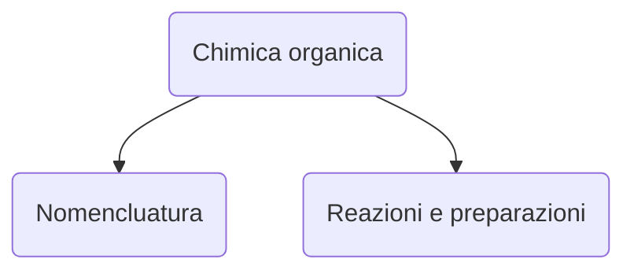

# Lezione di chimica (2° ora)
## Martedì 7 dicembre 2021, 08:59:00




|Nomenclatura|Reazioni e preparazioni|
|---|---|
|Alcani[^1] <hr />$$sp^3$$|saturi $\implies$ ==sostituzione== (meccanismo di reazione)[^2]|
|Alcheni[^3]<hr />$$sp^2$$|insaturi $\implies$ addizione _elettrofila_

[^1]:Alcani
``` 
Alcano
 | |
-C-C-
 | |
 ``` 

[^3]:Alcheni
``` 
Alcheno
\        /
 C  =  C 
/   pi   \
```
[^2]: ogni reazione di un gruppo funzionale ha una serie di passaggi correlati allo stesso
---
Classica reazione di compustione


$$
CH_4+2O_2\to \boxed{CO_2+2H_2O}\quad \Delta E
$$


<!--stackedit_data:
eyJoaXN0b3J5IjpbLTEzNzI2ODA2MjBdfQ==
-->