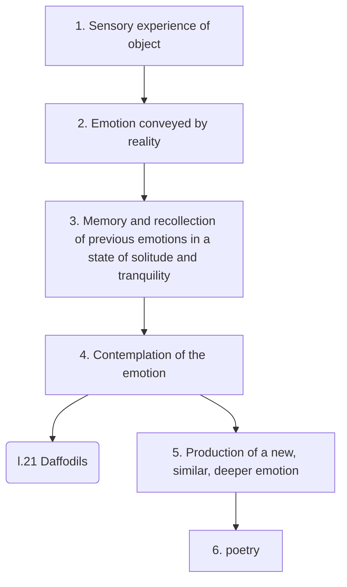

#  Lezione di Storia (6° ora)
## Lunedì 11 ottobre 2021, 13:13:00

Thanks to immagination the poet can shade a new light to a real object or to an emotion provoked by it (inner eye)

Poetic creation:

Wordswoth:

Poetry is nothing but emotion, feeling
spontaneous overflow of feelings

Poet: is a man speaking to other men

He is a man, can evoke passions similar to a real thing

Plesased with passions and volitions of the whole universe, not only his passions

he creates the passions and volitions when he does not find them

He can be influenced by absent things as they were present

The passion is not the same of the time but it resembles the oe 
<!--stackedit_data:
eyJoaXN0b3J5IjpbLTE0MTYxOTkwNTYsMTE1MTI2MzU0MCwtMT
I0OTY4NDg5MV19
-->