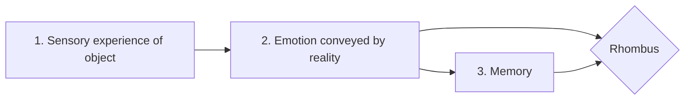

#  Lezione di Storia (6° ora)
## Lunedì 11 ottobre 2021, 13:13:00

Thanks to immagination the poet can shade a new light to a real object or to an emotion provoked by it (inner eye)

Poetic creation:

1. Sensory experience
Wordswoth:

Poetry is nothing but emotion, feeling
spontaneous overflow of feelings

<!--stackedit_data:
eyJoaXN0b3J5IjpbLTY1NTQzNDg3NF19
-->