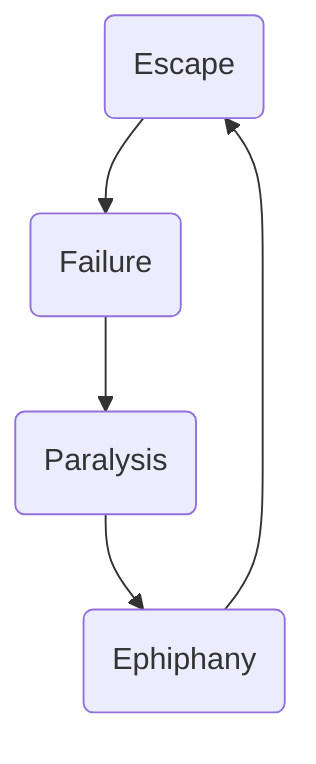

# Lezione di Inglese

Cubism: fragmentation of reality in all its different perceptions 

Einstenian relativity

No unique plot and story, diferent point of view, fous on the mind of the character

stream of consciousness: interior monologue

authors:
* Virgina Woolf
* James Joyce

srurrealist painting: distorsion of time

freud: fragmentation of the self

melting of time, relativity, typical in modernist literature

James Joyce's Ulysses,  the whole novel is set on one single day,
16th June 1904, 16th of june is usualy "blooms day" in dublin

Thick book, about 1000 pages
dilated time, eveything takes place in the mind of the character

national celebrations, they celebrate James Joyce

they remember the events of 

Mr Bloom: protagonist of ulysses

Also Mrs Dallaway, by W.Woolf is set on one single say

---

Modernism, p 167

Cultural movement involving different kinds of art , which spread in europe at the beginning of the 20th century

Aim: **experimentation** (of new forms of expressions)

_Novelty_
acceptance of new forms usually not widely accepted

Victorian standards were not suitable anymore to describe their sense of fragmentation, unaesyness, fragmentation, realtivity of time

Sociocultural context of the period

Prose:
* Woolf
* Joyce
Poetry:
* T.S. Elliot: angloamerrican, but always studied and travveled in europe (studied in Paris), and got the british citizenship

*Annus Mirabilis* of English modernist6 literature: 1922 links together the three authors

In this year:
* First modernist novel by Wirginia Woolf (_Jacob's room_)
* _Ulysses_, by James Joyce's masterpiece
* _The wasteland_, T.S. Elliot's masterpiece ("la terro desolata")

|Joyce|Woolf|
|---|--|
|Direct interior monologue (most experimental)|Indirect interior monologue|
|Dubliners (collection of stories set in Dublin)^1^, Ulysses, Finnegan's Wake (most experimental) |Jacob's Room, To the lightouse, Mrs: Dallaway, The Waves (the last, experimental, direct interior monologue)|
|Epiphany|Moment of being|

epiphany and moment of being are the same technique but the author calls it differently, but it means
> the sudden revelation of a truth in the life of the characters conveyed by something trivial

In one single moment, the whole meaning of a life is revealed, past present and future

> Eveline, 17, in Dubliners
> 
> Street organ playing in the street is playing the same music that Eveline had heard when her mother had died
She understand she did not want to have the same paralyzed life
Escape to Buenos Aires with her boyfriend
> 
> However, she will never go to Bueons Aires because Dublin stops her, the paralysis of the family and city, she is not brave enoguh to leave everything and go away
> 
> The dubliners are fragile, they want to escape but never do it
---
> ^1^ _"I want to write a chapter of a moral history of my country"_
> He percieved Dublin as the center of the **paralysis**, beacuse it is historycall stuck:
> * ==Religious reasons==: strictness of the gesuite church ( Joyce's parents were strict gesuites
> * ==Political reasons==: Influence of the british government (not indipendent)
> * ==Geographical reasons==: separated from the continnent
> He had a cosmopolitan approach

Joyce

He studied in paris, went back to ireland for mother's death

1905, voluntary exhile, he went to Trieste and he thaught engilsh

he had financials difficulty in Italy

After WWI he wento To Zurich

In 1922 he pubblished dubliners in paris

he suffers of almost blindness

He died in Zurich, 1931

Elliot:
* Objective correlative (like montale)
* mythical method
<!--stackedit_data:
eyJoaXN0b3J5IjpbMTIzMDA0NDIzMSwtNDk1ODI3MjM2XX0=
-->