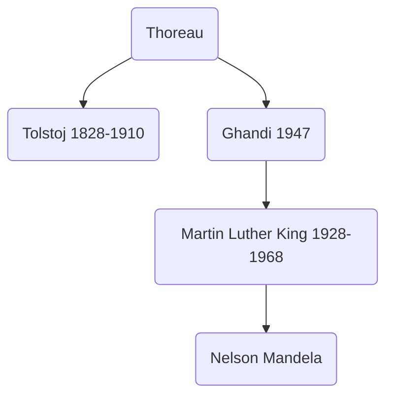

# Lezione di Storia (8° ora)
## Lunedì 8 novembre 2021, 12:08:00

H.D. Thoreau

contro allo spirito di conquista USA

UK era dispotica ed è anche il motivo di indipendenza USA

USA potenza dispotica non diverse da altre, dovrebbe essere presidio di libertà

Invita americani a sciopero fiscale

Re diritto ribellione, calvinismo

Thoreau scrive _sulla disobbidienza civile_

Obiezione di coscienza

Diritto di resistenza

(pacifista)

Ghandi (1947)

---

Paternalismo, ma schiavi con valore 

Schiavisti sostenevano che 

> Schiavi erano trattati meglio degli operai delle fabbriche del nord

Schiavi sono comunque ritenuti _cose_

---

Nord: cultura progredita, liberale

Movimento abolizionista

"Cultura della frontiera"

Crescenti ondate di pionieri

Conquista del midwest

Nord: parte del paese maggiormente popolata

Vicinanza economica nord-sud diventa vicinanza economica nord-est

no interesse in sistema economico schiavile

Stati del nord: protezionismo verso europa perchè le industrie europee producono prezzi più bassi

stati del sud hanno uno scambio molto positivo con europa, che si fanno  arrivare i prodotti europei e vendono agli europei

Prodotto stati nord sempre più costoso

accettano comunque, 1816, dazi bassi

1832, dazi elevati

Stati sud protestano veementemente

accettati a maggioranza

discussione su estensione schiavimo a stati ovest

Opposizione ovest:

Opposizione nord industriale: schiavi sono pessimi consumatori, acquirenti e non offrono manodopera
<!--stackedit_data:
eyJoaXN0b3J5IjpbLTIxMzM0NTgwMiwxNDkzNzIxNTc0LDE0Nz
IwNjExNjJdfQ==
-->