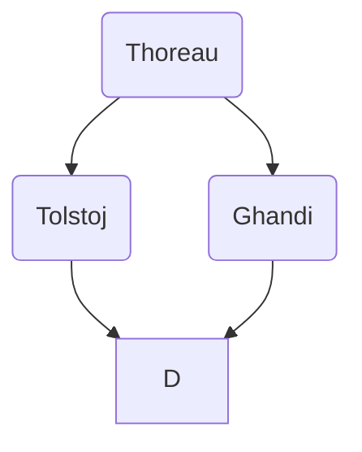

# Lezione di Storia (8° ora)
## Lunedì 8 novembre 2021, 12:08:00

H.D. Thoreau

contro allo spirito di conquista USA

UK era dispotica ed è anche il motivo di indipendenza USA

USA potenza dispotica non diverse da altre, dovrebbe essere presidio di libertà

Invita americani a sciopero fiscale

Re diritto ribellione, calvinismo

Thoreau scrive _sulla disobbidienza civile_

Obiezione di coscienza

Diritto di resistenza

(pacifista)

Ghandi (1947)

<!--stackedit_data:
eyJoaXN0b3J5IjpbLTgwMTM5Nzg0MF19
-->